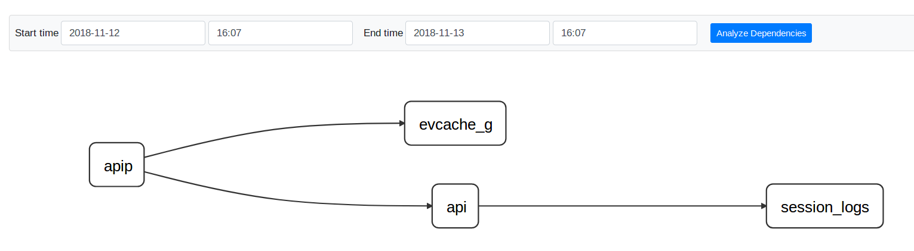
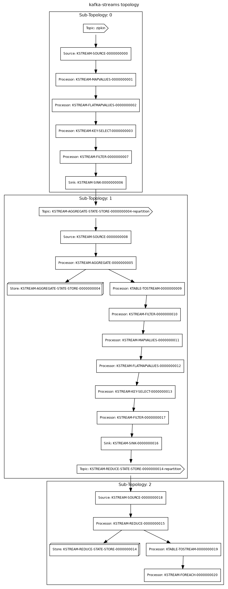

# zipkin-dependencies-streaming

Streaming service dependencies from Zipkin spans using Kafka Streams. 
Streaming version of <https://github.com/openzipkin/zipkin-dependencies>.

## How to use it

### Configuration

| Key                     | Description                                                                                     | Default Value     |
|-------------------------|-------------------------------------------------------------------------------------------------|-------------------|
| KAFKA_BOOTSTRAP_SERVERS | Kafka Bootstrap Servers where Zipkin Kafka Reporters store Span.                                | localhost:29092   |
| KAFKA_DEPENDENCY_TOPIC  | Kafka Topic where Zipkin Dependencies will be stored.                                           | zipkin-dependency |
| FORMAT                  | Zipkin format. Options: JSON_V1, JSON_V2, PROTO3.                                               | JSON_V2           |
| STORAGE_TYPE            | Storage where Zipkin dependencies will be forwarded. Options: STDOUT, ELASTICSEARCH, CASSANDRA. | STDOUT            |

> By default, dependencies are stored in a Kafka Topic, and print out to StdOut.

#### Elasticsearch Configuration

| Key                           | Description                         | Default Value   |
|-------------------------------|-------------------------------------|-----------------|
| ELASTICSEARCH_URLS            | Elasticsearch nodes URLs            | localhost:19200 |
| ELASTICSEARCH_INDEX           | Elasticsearch index prefix          | zipkin          |
| ELASTICSEARCH_DATE_SEPARATOR  | Separator for Dates on Index name.  | -               |

#### Cassandra Configuration

| Key                       | Description                     | Default Value |
|---------------------------|---------------------------------|---------------|
| CASSANDRA_CONTACT_POINTS  | Cassandra Contact Point hosts.  | localhost     |
| CASSANDRA_KEYSPACE        | Cassandra keyspace.             | zipkin        |

### Docker

Run: `docker-compose up -d` to start a Zipkin server with Elasticsearch storage, and Kafka as ingestion component.

#### Test

Run: `src/test/java/no/sysco/middleware/zipkin/dependencies/streaming/tools/SpanKafkaProducer.java` that will use the `spans.json` file to push spans via Kafka.

In less than 1 minutes, dependencies should be available under  <http://localhost:9411/zipkin/dependency/>

 

## Kafka Streams Topology

